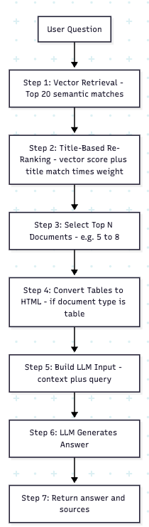

# Table of Contents:

1. Overview
2. Preprocessing before chunking
3. Summary of the embedding model
4. Explanation of the main files
5. Challanges and solutions
6. How to run the app

# Overview

This RAG pipeline answers user questions by retrieving and ranking the most relevant chunks from the Boeing 737 manual. The process combines semantic similarity with a custom title-based scoring method to improve accuracy.

1. **User submits a query.**

   The system takes the query text and prepares it for retrieval.
2. **Retrieve the top 25 chunks by semantic similarity.**

   The vector database returns the 25 most semantically similar chunks based on MPNet embeddings.
3. **Re-rank  and filter the 25 chunks using title matching.**

   Here the documents are reranked  by taking into account both vector similarity score and title matching score.
   Title matching score is calculated  by counting how many words of the query appear in the chunk's title metadata

   Reason for this strategy:

   1. It has improved retrieval for queries that spans multiple topics
   2. The titles in the document  are very descriptive of the content.
4. **Filter the 25 chunks down to the top 5.**

   After combining semantic similarity and title relevance, the system keeps only the 5 best chunks.

   These are the most reliable context pieces for answering the query.
5. **Send the top 5 chunks to the LLM.**

   The selected chunks become the context for the model.

   The LLM uses this context to generate a grounded, manual-based answer.
6. **Return the final answer and the source chunks.**

   The system outputs the answer along with the 5 retrieved sections for traceability.

In short: **semantic search finds broadly relevant content, the title-matching boosts precision, and the LLM answers using the best 5 sections.**

---

# Preprocessing before chunking

At this step the goal was to given the pdf file, extract different types of information in a structured way.

-> **pdf_file**->

    |-> tables.json

    |-> diagrams.json

    |-> texts,json

## Extracting text  => `extract_text.py`

The manual is chunked by detecting its real section headers instead of splitting text by size or length. This creates clean, meaningful chunks that match how the manual is written.

1. Detect headers , their  page number and and vertical position inside that page. The end  vertical position  and page of the header is naturally the start position of the next header
2. As a next step we will extract the content, given the boundaries-> Header's  starting point and ending point
3. At the end we get  list of  objects each object corresponds to  one header ->  it's title, content, and page_number
4. The last step is to turn this list into list of objects json file ->  ***texts.json***

Note : average  header size is determined to be  717.2 , that's why  when chunking, the chunk size  is 800.  This ensures that the retrieved chunk corresponds to one clear section  inside the manual.

text objects are stored in

---

## Extracting diagrams

The extraction of diagrams  is done with GPT 5.1 model. Each diagram is presented to the vision model. The accuracy of diagram descriptions had to be checked manuallly for precision.  Here is the prompt I have used:

> Your task is to  write a description of the given diagram.  Give a detailed  explanation of the diagram. Make sure every  detail you give is backed by the diagram labels that is already present. Include the diagram header and the section in the detail as well. The description should be optimized for RAG retrieval.

Output of the model

```
{"chapter": "Airplane General, Emergency Chapter 1 – Equipment, Doors, Windows","section": "Fire Extinguisher","page_number": 145,"title": "Water Fire Extinguisher","description": "Illustration of water fire extinguisher with trigger, safety wire, discharge nozzle, and handle. Intended for Class A fires involving combustible materials.Water fire extinguishers contain a solution of water mixed with antifreeze. Thecontainer  is  pressurized  by  a  CO2  cartridge  when  the  extinguisher  handle  isrotated fully clockwise. The extinguisher should be used on fabric, paper or woodfires only.To use the water fire extinguisher:remove from stowage rotate handle fully clockwise aim at base of fire and press trigger. CAUTION: Do not use on electrical or grease type fires ","type": "diagram"    },
```

Diagrams are stored in ***diagrams.json*** file

## Extracting tables

The extraction oftables  is done with GPT 5.1 model. Each table is presented to the vision model. The accuracy of table descriptions had to be checked manuallly for precision.  Here is the prompt I have used:

> Your task is to  write a description of the given table.  Give a detailed  explanation of the table . Include the column headers, in the descriptions if applicable, Include the table  header and the section in the description as as well. The description should be optimized for RAG retrieval.

Output of the model

```
{"chapter": "Normal Procedures","section": "Landing Procedure","title": "Landing Procedure","page_number": 45,"csv_path": "tables/normal_procedures/landing_procedure.csv","description": "This table details the duties of the Pilot Flying (PF) and Pilot Not Flying (PNF) during the Landing Procedure. Some tasks are unique to each role, while several must be performed by both. Shared responsibilities include verifying mode annunciation, verifying proper mode annunciation and setting missed approach altitude at glide slope capture, checking crossing altitude at the final approach fix/outer marker, and monitoring approach progress. Both crew members must also verify FLARE arming at 500 feet AGL, verify FLARE engagement at approximately 50 feet AGL, and ensure the autothrottle retards the thrust levers to idle by touchdown. The table also includes PF- and PNF-specific duties such as flap selection, gear configuration, and checklist execution.","type": "table"    },
```

Along with the json object, csv file was also returned from the model. The accuracy  of the extracted csv had to be checked  manually, to ensure precision.

Tables are stored in ***tables.json***

# Embedding Model Summary

This project uses the **sentence-transformers/all-mpnet-base-v2** embedding model.

It is a  **local** , state-of-the-art sentence embedding model designed to convert text into dense vector representations suitable for semantic search and retrieval.

### Key properties:

* **Model Type:** Transformer-based encoder (MPNet architecture)
* **Vector Size:** 768 dimensions
* **Training Objective:** Contrastive learning on large-scale NLI + paraphrase datasets
* **Strengths:**
  * High semantic similarity accuracy
  * Excellent for retrieval-augmented generation (RAG)
  * Robust on domain-specific texts (technical manuals, aviation content)
  * Fast inference on CPU and even faster on Apple Silicon (MPS)

### Why this model?

* It consistently ranks among the **top performers** on semantic search benchmarks.
* Works seamlessly with Chroma for fast vector storage and retrieval.
* Can be run on CPU  without a problem.

# Explanation of the main files

## *pipeline.py*

This file contains the  main logic of the rag_pipeline.

Here is the  the visualisation of the pipeline



## *build_vector_store.py*

This script is responsible for loading json files, chunking them then storing it locally in croma_db folder.

## *embeddings.py*

Contains  two functions

1. *load_vector_store()* -> loads the   local vector store and returns the chroma instance
2. *load_embeddings()*->  returns the embedding  instance

## *llm.py*

Contains one function

1. *create_llm()-*> returns   Langchain ChatOpenAI instance

## *retrieval.py*

Contains one function

1. *retrieve_with_scores()*- >  acceps query, and vector db instance, and returns  chunks  with relevance scores

## *scoring.py*

Contains one function

1. *title_weighted_reranker() acceps the query and retrieved documents with their score,   rerankes the documents  by incorporating how many words in the query appear in the chunk's title, then returns top 5 documents based on new ranking*

## utils.py

Contains three functions

1. clean_tokenize ()-> accepts  a string, removes the punctuations.
2. count_keyword_matches()-> accepts  cleaned query and  a chunk title
3. convert_tables_to_html()-> accepts documents, if document is a table, parses  the corresponding csv file into html , and attaches it to the document_content:

## main.py

Contains the api end point /ask to send queries via json, and returns the LLM answer and  referenced pages.

---

# Challenges and Solutions

### **1. Parsing Tables Accurately**

**Challenge:**

The tables in the PDF were difficult for the LLM to understand in their raw text form. Converting them directly from the PDF often produced messy or incomplete results.

**How I solved it:**

* I used GPT-5.1 Vision to read each table from the PDF and convert it into a  **clean CSV file** .
* Some tables were not extracted perfectly, so I manually reviewed and corrected the CSV files.
* After cleaning, I converted the CSV files into  **HTML tables** , because the LLM understands the structure and relationships much better when the table is in HTML format.

**Future improvement:**

This entire workflow can be automated.

A vision-based agent could:

1. Detect all tables on a page
2. Convert each table to CSV
3. Allow the user to approve or edit the result
4. Save the cleaned file automatically

   This would remove the manual effort currently required.

---

### **2. Improving Retrieval Using Document Titles**

**Challenge:**

I noticed that sometimes the **title** of a chunk was more informative than the chunk content itself.

This especially became a problem when the user asked  **multiple questions at once** , because pure semantic similarity didn't always prioritize the most relevant sections.

**How I solved it:**

* I added a **custom re-ranking step** to the retrieval pipeline.
* After pulling the top 20–25 documents by vector similarity, I re-ranked them again based on  **how many query words appear in the document title** .
* This “title overlap score” is multiplied by a  **weight** , which lets me adjust how strongly it affects the final ranking.

**Result:**

This improved accuracy noticeably—especially for multi-part questions or queries where the title carries more meaning than the content.

The final retrieval pipeline now combines:

* semantic similarity
* title overlap score
* adjustable weighting

to produce more reliable results.

# How to run the app

After cloning the remote repo

`https://github.com/perviz822/boeing_737.git`

1. Create  .env file in the root folder and place the env variables
   then->
2. `pip install -r requirements.txt`
   then->
3. `python  build_vector_store.py`

**Note**:`build_vector_store.py`will  load hugging_face embedding model locally in the rootfolder/models/ and it will create embeddings locally in `chroma_db` folder. This process might take several minutes.

4. To run the fast api app
   uvicorn main:app

This command will run the application  in `localhost:8000` by default. By accessing  localhost:8000/docs, ` /ask` api end will appear.
